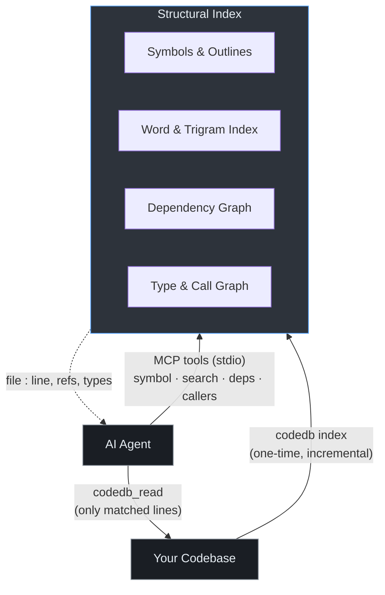

# codedb

Code intelligence MCP server for AI agents. Indexes a codebase once, serves
symbol lookups, search, and dependency queries in under 1ms.

## Origin

This is a fork of [justrach/codedb](https://github.com/justrach/codedb) by
**Rach Pradhan** ([@justrach](https://github.com/justrach)), licensed under
the [BSD 3-Clause License](LICENSE).

All original work and copyright belong to the upstream author. This fork is
maintained independently and is not affiliated with or endorsed by the
original project.

## License

BSD 3-Clause License. See [LICENSE](LICENSE) for the full text.

Copyright (c) 2024-2026, Rach Pradhan (justrach).

Redistribution and use in source and binary forms, with or without
modification, are permitted provided that the conditions in the LICENSE file
are met.

## Contributing

This is a private fork. Contributions are not accepted from external
contributors. See [CONTRIBUTING.md](CONTRIBUTING.md) for the upstream
project's contribution guidelines if you are working with the original
[justrach/codedb](https://github.com/justrach/codedb) repository.

## How It Works

codedb parses your source code into a structural index — not just text, but
symbols, types, call graphs, and dependency chains. An AI agent queries this
index through MCP to understand your codebase without reading every file.

### Indexing

When you run `codedb /path/to/project`, it:

1. **Walks** the file tree, skipping `.gitignore`/`.codedbignore` patterns
2. **Parses** each file with a language-aware parser (C#, F#, Zig, Razor, JS, TS, Python, Go, Rust, and more)
3. **Extracts** symbols — classes, functions, interfaces, enums, imports — with line-precise locations
4. **Builds** an inverted word index, trigram index, and dependency graph
5. **Writes** a `codedb.snapshot` (portable, binary) and a central cache at `~/.codedb/projects/`

Subsequent runs are incremental — only changed files are re-parsed.

### What the index contains

```
Source File
    ├── Symbols        (class, function, interface, enum, const)
    │   ├── Name
    │   ├── Kind
    │   ├── Line range
    │   ├── Decorators   ([Authorize], [HttpPost], etc.)
    │   └── Body         (optional, on-demand)
    ├── Imports        (what this file depends on)
    ├── Exports        (what this file provides)
    └── Word index     (every identifier, O(1) lookup)

Cross-file
    ├── Dependency graph   (file → imports → files)
    ├── Call graph         (function → callers → functions)
    ├── Type graph         (interface → implementations)
    └── Inheritance tree   (class → bases → derived)
```

### How an agent uses it

An AI agent connected to codedb via MCP can:

```
Agent: "What calls the PaymentService.ProcessRefund method?"

  1. codedb_symbol name="ProcessRefund"     → finds definition at src/Services/PaymentService.cs:142
  2. codedb_callers name="ProcessRefund"    → returns 3 call sites with context
  3. codedb_read path=... lines="140-160"   → reads the implementation

  Total: ~10ms, 3 round trips, zero file scanning
```

Without codedb, the agent would have to `grep` across hundreds of files,
parse each match, and hope it didn't miss anything. With codedb, it gets
precise structural answers in milliseconds.

### Typical agent workflows

| Task | codedb tools used |
|------|-------------------|
| Find a bug's origin | `search` → `callers` → `read` |
| Understand a feature | `find` → `outline` → `deps transitive=true` |
| Impact analysis before refactor | `symbol` → `callers` → `types` |
| Navigate unfamiliar code | `tree` → `outline grouped=true` → `search` |
| ASP.NET config audit | `config_xref` → `routes` |



---

## Prerequisites

**Linux / macOS:** `curl` (usually pre-installed)
**Windows:** PowerShell 5.1+ (built into Windows)

---

## Install

### Linux / macOS

```bash
curl -fsSL https://raw.githubusercontent.com/jwvolschenk/codedb/main/scripts/setup-codedb.sh | bash
```

### Windows (native PowerShell)

```powershell
irm https://raw.githubusercontent.com/jwvolschenk/codedb/main/scripts/setup-codedb.ps1 | iex
```

No WSL, Git Bash, or git required. Runs natively in PowerShell.

This will:
1. Download the latest binary from [Releases](https://github.com/jwvolschenk/codedb/releases)
2. Install to `~/.local/bin/codedb` (Linux/macOS) or `$env:LOCALAPPDATA\codedb\bin` (Windows)

### Install for a specific agent

Pass `--agent` to get MCP registration instructions for your agent after install.

**Linux / macOS:**

```bash
curl -fsSL https://raw.githubusercontent.com/jwvolschenk/codedb/main/scripts/setup-codedb.sh | bash -s -- --agent Copilot
```

**Windows (PowerShell):**

```powershell
$script = "$env:TEMP\setup-codedb.ps1"; irm https://raw.githubusercontent.com/jwvolschenk/codedb/main/scripts/setup-codedb.ps1 -OutFile $script; & $script -Agent Copilot
```

Available agents: `Hermes`, `Copilot`, `Claude`, `Codex`, `Gemini`, `Antigravity`, `Cursor`

### Update

Re-run the same one-liner for your platform.

### Uninstall

```bash
codedb nuke
```

Removes the binary, cached indexes, and MCP registrations from all detected
agents. No repo checkout required.

---

## Verify

After install, restart your agent session. Then ask: *"What files are in
this project?"* — the agent should call `codedb_tree` to answer.

```bash
# Manual check
codedb --version
codedb tree
```

---

## .codedbignore

Exclude vendor code, build artifacts, and non-source files from indexing.
Create `.codedbignore` in your project root (next to `.gitignore`).

**Start from your `.gitignore`** — anything that's not source code
(vendor dirs, build output, IDE caches, compiled binaries) is a good
candidate. The goal is to index only files an AI agent needs to
*understand and modify your codebase*.

<details>
<summary><strong>Example: .NET / C# projects</strong></summary>

```
# ── Vendor / package directories ──────────────────────────
# (directory pattern: matches at any depth)
Lib/
packages/
vendor/
node_modules/
bower_components/

# ── Build output (future-proof even if not present yet) ───
bin/
obj/
Debug/
Release/
artifacts/
publish/

# ── Binary / compiled files ───────────────────────────────
# (glob pattern: matches by extension)
*.nupkg
*.dll
*.exe
*.pdb
*.bundle.js
*.map

# ── Auto-generated code ───────────────────────────────────
# (path prefix: matches from project root)
src/Connected Services

# ── Static assets not useful for code intelligence ────────
src/wwwroot/lib
src/wwwroot/fonts
src/wwwroot/themes
src/wwwroot/css

# ── IDE / tool configs ────────────────────────────────────
# (exact name: matches at any depth)
.vs/
.idea/
.vscode/
.mcp.json

# ── CI / deployment infra ─────────────────────────────────
Dockerfile
Jenkinsfile
.dockerignore

# ── Runtime / package manager configs ─────────────────────
appsettings.json
appsettings.Development.json
NuGet.Config
package-lock.json

# ── Data / metadata files ─────────────────────────────────
Models.xml
*.min.js
```

</details>

<details>
<summary><strong>Example: Node.js / TypeScript projects</strong></summary>

```
# Vendor
node_modules/
bower_components/
.pnp/

# Build output
dist/
build/
out/
.next/
.nuxt/

# Compiled / generated
*.js.map
*.d.ts
*.min.js
*.bundle.js

# IDE / tool
.vs/
.idea/
.vscode/

# Lock files / configs
package-lock.json
yarn.lock
pnpm-lock.yaml
.env
.env.*

# Test coverage / caches
coverage/
.nyc_output/
.cache/
```

</details>

### Pattern syntax

| Pattern | What it matches | Example |
|---------|----------------|---------|
| `dirname/` | Directory name at any depth (case-insensitive) | `node_modules/` matches `src/node_modules` |
| `*.ext` | File extension (case-insensitive) | `*.dll` matches `Foo.DLL` |
| `/path` | Root-anchored path only | `/src/generated` matches `src/generated` but not `lib/src/generated` |
| `name` | Exact name at any depth, OR path prefix (matches at `/` boundary) | `Dockerfile` matches anywhere; `src/vendor` matches `src/vendor/foo` |

All matching is **case-insensitive**.

**Tips:**
- Use `*.ext` for file types, not full paths
- Use directory names without trailing path for broad matching (`vendor/` not `src/vendor/`)
- Use path prefixes for project-specific directories (`src/Connected Services`)
- Patterns from `.gitignore` that use `[Cc]ase` ranges won't work — use exact names instead
- Without `.codedbignore`, a typical .NET project indexes thousands of vendor files. With it, only the actual source.

---

## .codedbrc

Per-project or global configuration. Place `.codedbrc` in your project root
(next to `.codedbignore`) or in the codedb binary directory for global defaults.

Resolution order (first match wins):
1. `--config-file=<path>` (explicit)
2. `$CWD/.codedbrc` (project-level)
3. `<binary_dir>/.codedbrc` (global fallback)

One `key = value` per line. Blank lines and `#`-prefixed lines are ignored.
Unknown keys are silently ignored so upgrades don't break older configs.

<details>
<summary><strong>Example .codedbrc</strong></summary>

```
# ── Version history ───────────────────────────────────────
# Cap per-file version history in the Store. Default: 100.
max_versions = 100

# ── Content cache ─────────────────────────────────────────
# Max files kept in the Explorer's in-memory cache. Default: 1000.
max_cached = 1000

# ── Rerank tracing ────────────────────────────────────────
# Append one JSON line per search invocation to
# <data_dir>/rerank-traces.jsonl for offline tuning experiments.
# Default: false
rerank_trace = false

# ── Generated files ───────────────────────────────────────
# Index generated code artifacts (EF Migrations/*, *.Designer.cs,
# *.g.cs, *.generated.*). Default: false — they're skipped at index
# time. Even when set to true, search/word/callers still filter them
# out unless you pass include_generated=true to the call.
index_generated_files = false
```

</details>

### Settings reference

| Setting | Default | Increase when | Decrease when |
|---------|---------|---------------|---------------|
| `max_versions` | 100 | You edit files frequently and need deep history | Disk space is tight |
| `max_cached` | 1000 | You work on very large monorepos (1000+ files) | Memory is constrained |
| `rerank_trace` | false | Tuning search relevance offline | Not actively experimenting |
| `index_generated_files` | false | Investigating EF migrations / source-generated code | Default — keeps generated noise out of the index |

### Agent Precision Defaults

- `codedb_callers` defaults to `match_mode="semantic"`, a fast heuristic that keeps
  invocation-looking call sites (`Probe(...)`, `service.Probe(...)`, `Probe<T>(...)`) and
  drops strings/comments/plain mentions. Pass `match_mode="text"` for the older broad
  whole-word behavior or `match_mode="both"` for maximum recall.
- `codedb_deps direction="imported_by"` now includes type-usage edges for C#/F#/JVM and
  TypeScript-style files. Return types, parameter types, fields, and properties can create
  dependency edges, so entity files surface repository/service/controller dependents even
  without explicit import-path links.
- `codedb_deps output_format="json"` and `codedb_relations output_format="json"` return
  machine-friendly grouped JSON with `confidence`, `why_matched`, and `semantic_kind`
  metadata.
- `codedb_relations symbol="Probe"` returns a one-shot relation map: definitions,
  inheritance, dependency/type-usage users, and heuristic callers.

---

## Agent Configuration

The setup script auto-detects and registers with installed agents.
Manual configuration below if needed.

<details>
<summary><strong>Hermes</strong> — <code>~/.hermes/config.yaml</code></summary>

```yaml
mcp_servers:
  codedb:
    command: ~/.local/bin/codedb
    args:
      - mcp
    enabled: true
```

</details>

<details>
<summary><strong>GitHub Copilot</strong> — <code>~/.copilot/mcp-config.json</code></summary>

```json
{
  "mcpServers": {
    "codedb": {
      "command": "~/.local/bin/codedb",
      "args": ["mcp"]
    }
  }
}
```

</details>

<details>
<summary><strong>Claude Code</strong> — <code>~/.claude.json</code></summary>

```json
{
  "mcpServers": {
    "codedb": {
      "command": "~/.local/bin/codedb",
      "args": ["mcp"]
    }
  }
}
```

</details>

<details>
<summary><strong>OpenAI Codex</strong> — <code>~/.codex/config.toml</code></summary>

```toml
[mcp_servers.codedb]
command = "~/.local/bin/codedb"
args = ["mcp"]
startup_timeout_sec = 30
```

</details>

<details>
<summary><strong>Gemini CLI</strong> — <code>~/.gemini/settings.json</code></summary>

```json
{
  "mcpServers": {
    "codedb": {
      "command": "~/.local/bin/codedb",
      "args": ["mcp"]
    }
  }
}
```

</details>

<details>
<summary><strong>Cursor</strong> — <code>~/.cursor/mcp.json</code></summary>

```json
{
  "mcpServers": {
    "codedb": {
      "command": "~/.local/bin/codedb",
      "args": ["mcp"]
    }
  }
}
```

</details>

<details>
<summary><strong>Windows (WSL2 bridge)</strong></summary>

```json
{
  "servers": {
    "codedb": {
      "command": "wsl",
      "args": ["~/.local/bin/codedb", "${workspaceFolder}", "mcp"]
    }
  }
}
```

</details>

---

## Agent Skills: codedb Instructions

A single usage guide is provided at `skills/codedb-instructions.md`. It covers
indexing, search, symbols, dependencies, batching patterns, and common
workflows. Copy it to your agent's instruction location using the table below.

| Agent | Location | Format |
|-------|----------|--------|
| **Hermes** | `~/.hermes/skills/codedb-instructions/SKILL.md` | Agent Skills standard |
| **Claude Code** | `~/.claude/skills/codedb-instructions/SKILL.md` | Agent Skills standard |
| **OpenAI Codex** | `~/.codex/skills/codedb-instructions/SKILL.md` | Agent Skills standard |
| **Antigravity** | `~/.agy/skills/codedb-instructions/SKILL.md` | Agent Skills standard |
| **OpenCode** | `~/.config/opencode/skills/codedb-instructions/SKILL.md` | Agent Skills standard |
| **GitHub Copilot** | `<your-repo>/.github/instructions/codedb.instructions.md` | Project-level instructions |
| **Gemini CLI** | `~/.gemini/commands/codedb-instructions.toml` | TOML command file |
| **Cursor** | `<your-repo>/.cursor/rules/codedb.instructions.md` | Project-level rules |

### Agent Skills standard (Hermes, Claude, Codex, Antigravity, OpenCode)

These agents share the same SKILL.md format. Copy and rename:

```bash
# Example: Hermes
mkdir -p ~/.hermes/skills/codedb-instructions
cp skills/codedb-instructions.md ~/.hermes/skills/codedb-instructions/SKILL.md

# Example: Claude Code
mkdir -p ~/.claude/skills/codedb-instructions
cp skills/codedb-instructions.md ~/.claude/skills/codedb-instructions/SKILL.md
```

### GitHub Copilot (VS Code / Copilot in IDE)

Copy to your repo's `.github/instructions/` directory. The `.instructions.md`
suffix is required for project-level rules. Copilot auto-loads files in
`.github/instructions/`.

```bash
cp skills/codedb-instructions.md /path/to/your/repo/.github/instructions/codedb.instructions.md
```

### Gemini CLI

Gemini uses TOML command files. Wrap the markdown content in a TOML `prompt`
field:

```bash
mkdir -p ~/.gemini/commands
# Convert: wrap the markdown in a TOML prompt string
echo 'prompt = """' > ~/.gemini/commands/codedb-instructions.toml
cat skills/codedb-instructions.md >> ~/.gemini/commands/codedb-instructions.toml
echo '"""' >> ~/.gemini/commands/codedb-instructions.toml
echo 'description = "codedb code intelligence MCP tools"' >> ~/.gemini/commands/codedb-instructions.toml
```

### Cursor

Copy to your repo's `.cursor/rules/` directory:

```bash
cp skills/codedb-instructions.md /path/to/your/repo/.cursor/rules/codedb.instructions.md
```

---

## Build from Source

```bash
git clone https://github.com/jwvolschenk/codedb.git
cd codedb
bash scripts/build-codedb.sh
```

Requires **Zig 0.16.0** (auto-installed by the build script if missing).

---

## Maintainers: Publish a Release

```bash
bash scripts/publish-codedb.sh
```

Requires `gh auth login`. Builds from local source, uploads to GitHub Releases.

---

## MCP Tools

| Tool | Speed | Use |
|------|-------|-----|
| `codedb_tree` | <0.1ms | Project structure |
| `codedb_outline` | <1ms | File symbols |
| `codedb_symbol` | <4ms | Find definition |
| `codedb_search` | <50ms | Full-text search |
| `codedb_word` | <1ms | Identifier lookup |
| `codedb_deps` | <2ms | Import graph |
| `codedb_read` | <1ms | Read file/range |
| `codedb_edit` | <1ms | Line-based edit |
| `codedb_hot` | <4ms | Recent changes |
| `codedb_find` | <5ms | Fuzzy filename |
| `codedb_remote` | varies | Public repo query |
| `codedb_index` | varies | Index a folder |
| `codedb_status` | <1ms | Index info |
| `codedb_changes` | <1ms | File changes |

---

## Repo Structure

```
codedb/
├── src/
│   ├── csharp_parser.zig    # C# parser
│   ├── fsharp_parser.zig    # F# parser
│   ├── ssrs_parser.zig      # SSRS/RDL parser
│   ├── tsql_parser.zig      # T-SQL parser
│   ├── snapshot.zig          # Snapshot format
│   ├── watcher.zig           # File walker + .codedbignore
│   ├── config.zig            # .codedbrc loader
│   ├── nuke.zig              # Built-in uninstall (codedb nuke)
│   ├── mcp.zig               # MCP server
│   └── ...
├── scripts/
│   ├── setup-codedb.sh      # Consumer install (Linux/macOS)
│   ├── setup-codedb.ps1     # Consumer install (Windows)
│   ├── build-codedb.sh      # Build from source
│   ├── publish-codedb.sh    # Publish release
│   └── e2e_mcp_test.py      # E2E MCP tests
├── skills/
│   └── codedb-instructions.md  # Agent usage guide (single file)
├── docs/
│   └── ...
├── build.zig
└── README.md
```
