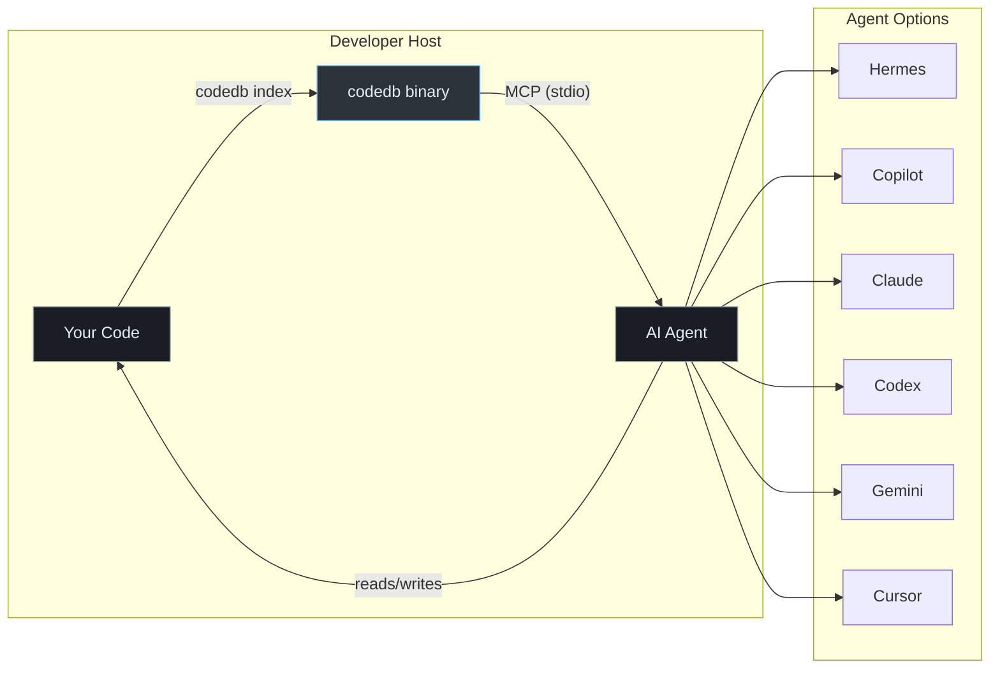

# codedb

Code intelligence MCP server for AI agents. Indexes a codebase once, serves
symbol lookups, search, and dependency queries in under 1ms.

## Origin

This is a fork of [justrach/codedb](https://github.com/justrach/codedb) by
**Rach Pradhan** ([@justrach](https://github.com/justrach)), licensed under
the [BSD 3-Clause License](LICENSE).

All original work and copyright belong to the upstream author. This fork is
maintained independently and is not affiliated with or endorsed by the
original project.

## License

BSD 3-Clause License. See [LICENSE](LICENSE) for the full text.

Copyright (c) 2024-2026, Rach Pradhan (justrach).

Redistribution and use in source and binary forms, with or without
modification, are permitted provided that the conditions in the LICENSE file
are met.

## Contributing

This is a private fork. Contributions are not accepted from external
contributors. See [CONTRIBUTING.md](CONTRIBUTING.md) for the upstream
project's contribution guidelines if you are working with the original
[justrach/codedb](https://github.com/justrach/codedb) repository.

## How It Works



---

## Prerequisites

**Linux / macOS:** `curl` (usually pre-installed)
**Windows:** PowerShell 5.1+ (built into Windows)

---

## Install

### Linux / macOS

```bash
curl -fsSL https://raw.githubusercontent.com/jwvolschenk/codedb/main/scripts/setup-codedb.sh | bash
```

### Windows (native PowerShell)

```powershell
irm https://raw.githubusercontent.com/jwvolschenk/codedb/main/scripts/setup-codedb.ps1 | iex
```

No WSL, Git Bash, or git required. Runs natively in PowerShell.

This will:
1. Download the latest binary from [Releases](https://github.com/jwvolschenk/codedb/releases)
2. Install to `~/.local/bin/codedb` (Linux/macOS) or `$env:LOCALAPPDATA\codedb\bin` (Windows)
3. Register with all detected AI agents

### Update

Re-run the same one-liner for your platform.

### Uninstall

```bash
bash scripts/uninstall-codedb.sh
```

---

## Verify

After install, restart your agent session. Then ask: *"What files are in
this project?"* — the agent should call `codedb_tree` to answer.

```bash
# Manual check
codedb --version
codedb tree
```

---

## .codedbignore

Exclude vendor code, build artifacts, and non-source files from indexing.
Create `.codedbignore` in your project root (next to `.gitignore`).

**Start from your `.gitignore`** — anything that's not source code
(vendor dirs, build output, IDE caches, compiled binaries) is a good
candidate. The goal is to index only files an AI agent needs to
*understand and modify your codebase*.

<details>
<summary><strong>Example: .NET / C# projects</strong></summary>

```
# ── Vendor / package directories ──────────────────────────
# (directory pattern: matches at any depth)
Lib/
packages/
vendor/
node_modules/
bower_components/

# ── Build output (future-proof even if not present yet) ───
bin/
obj/
Debug/
Release/
artifacts/
publish/

# ── Binary / compiled files ───────────────────────────────
# (glob pattern: matches by extension)
*.nupkg
*.dll
*.exe
*.pdb
*.bundle.js
*.map

# ── Auto-generated code ───────────────────────────────────
# (path prefix: matches from project root)
src/Connected Services

# ── Static assets not useful for code intelligence ────────
src/wwwroot/lib
src/wwwroot/fonts
src/wwwroot/themes
src/wwwroot/css

# ── IDE / tool configs ────────────────────────────────────
# (exact name: matches at any depth)
.vs/
.idea/
.vscode/
.mcp.json

# ── CI / deployment infra ─────────────────────────────────
Dockerfile
Jenkinsfile
.dockerignore

# ── Runtime / package manager configs ─────────────────────
appsettings.json
appsettings.Development.json
NuGet.Config
package-lock.json

# ── Data / metadata files ─────────────────────────────────
Models.xml
*.min.js
```

</details>

<details>
<summary><strong>Example: Node.js / TypeScript projects</strong></summary>

```
# Vendor
node_modules/
bower_components/
.pnp/

# Build output
dist/
build/
out/
.next/
.nuxt/

# Compiled / generated
*.js.map
*.d.ts
*.min.js
*.bundle.js

# IDE / tool
.vs/
.idea/
.vscode/

# Lock files / configs
package-lock.json
yarn.lock
pnpm-lock.yaml
.env
.env.*

# Test coverage / caches
coverage/
.nyc_output/
.cache/
```

</details>

### Pattern syntax

| Pattern | What it matches | Example |
|---------|----------------|---------|
| `dirname/` | Directory name at any depth (case-insensitive) | `node_modules/` matches `src/node_modules` |
| `*.ext` | File extension (case-insensitive) | `*.dll` matches `Foo.DLL` |
| `/path` | Root-anchored path only | `/src/generated` matches `src/generated` but not `lib/src/generated` |
| `name` | Exact name at any depth, OR path prefix (matches at `/` boundary) | `Dockerfile` matches anywhere; `src/vendor` matches `src/vendor/foo` |

All matching is **case-insensitive**.

**Tips:**
- Use `*.ext` for file types, not full paths
- Use directory names without trailing path for broad matching (`vendor/` not `src/vendor/`)
- Use path prefixes for project-specific directories (`src/Connected Services`)
- Patterns from `.gitignore` that use `[Cc]ase` ranges won't work — use exact names instead
- Without `.codedbignore`, a typical .NET project indexes thousands of vendor files. With it, only the actual source.

---

## .codedbrc

Per-project or global configuration. Place `.codedbrc` in your project root
(next to `.codedbignore`) or in the codedb binary directory for global defaults.

Resolution order (first match wins):
1. `--config-file=<path>` (explicit)
2. `$CWD/.codedbrc` (project-level)
3. `<binary_dir>/.codedbrc` (global fallback)

One `key = value` per line. Blank lines and `#`-prefixed lines are ignored.
Unknown keys are silently ignored so upgrades don't break older configs.

<details>
<summary><strong>Example .codedbrc</strong></summary>

```
# ── Version history ───────────────────────────────────────
# Cap per-file version history in the Store. Default: 100.
max_versions = 100

# ── Content cache ─────────────────────────────────────────
# Max files kept in the Explorer's in-memory cache. Default: 1000.
max_cached = 1000

# ── Rerank tracing ────────────────────────────────────────
# Append one JSON line per search invocation to
# <data_dir>/rerank-traces.jsonl for offline tuning experiments.
# Default: false
rerank_trace = false
```

</details>

### Settings reference

| Setting | Default | Increase when | Decrease when |
|---------|---------|---------------|---------------|
| `max_versions` | 100 | You edit files frequently and need deep history | Disk space is tight |
| `max_cached` | 1000 | You work on very large monorepos (1000+ files) | Memory is constrained |
| `rerank_trace` | false | Tuning search relevance offline | Not actively experimenting |

---

## Agent Configuration

The setup script auto-detects and registers with installed agents.
Manual configuration below if needed.

<details>
<summary><strong>Hermes</strong> — <code>~/.hermes/config.yaml</code></summary>

```yaml
mcp_servers:
  codedb:
    command: ~/.local/bin/codedb
    args:
      - mcp
    enabled: true
```

</details>

<details>
<summary><strong>GitHub Copilot</strong> — <code>~/.copilot/mcp-config.json</code></summary>

```json
{
  "mcpServers": {
    "codedb": {
      "command": "~/.local/bin/codedb",
      "args": ["mcp"]
    }
  }
}
```

</details>

<details>
<summary><strong>Claude Code</strong> — <code>~/.claude.json</code></summary>

```json
{
  "mcpServers": {
    "codedb": {
      "command": "~/.local/bin/codedb",
      "args": ["mcp"]
    }
  }
}
```

</details>

<details>
<summary><strong>OpenAI Codex</strong> — <code>~/.codex/config.toml</code></summary>

```toml
[mcp_servers.codedb]
command = "~/.local/bin/codedb"
args = ["mcp"]
startup_timeout_sec = 30
```

</details>

<details>
<summary><strong>Gemini CLI</strong> — <code>~/.gemini/settings.json</code></summary>

```json
{
  "mcpServers": {
    "codedb": {
      "command": "~/.local/bin/codedb",
      "args": ["mcp"]
    }
  }
}
```

</details>

<details>
<summary><strong>Cursor</strong> — <code>~/.cursor/mcp.json</code></summary>

```json
{
  "mcpServers": {
    "codedb": {
      "command": "~/.local/bin/codedb",
      "args": ["mcp"]
    }
  }
}
```

</details>

<details>
<summary><strong>Windows (WSL2 bridge)</strong></summary>

```json
{
  "servers": {
    "codedb": {
      "command": "wsl",
      "args": ["~/.local/bin/codedb", "${workspaceFolder}", "mcp"]
    }
  }
}
```

</details>

---

## Agent Skills: codedb Instructions

Install the codedb usage guide so your AI agent knows how to use codedb effectively. The guide covers indexing, search, symbols, dependencies, batching patterns, and mono-repo workflows.

Skills are available in `skills/` with platform-specific formats. Copy the appropriate file to your agent's skill location.

<details>
<summary><strong>Hermes</strong> — <code>~/.hermes/skills/codedb-instructions/SKILL.md</code></summary>

Uses the Agent Skills standard. Copy the skill directory:

```bash
mkdir -p ~/.hermes/skills/codedb-instructions
cp skills/hermes/codedb-instructions/SKILL.md ~/.hermes/skills/codedb-instructions/SKILL.md
```

Hermes auto-discovers skills in `~/.hermes/skills/`. Restart your session to load.

</details>

<details>
<summary><strong>Claude Code</strong> — <code>~/.claude/skills/codedb-instructions/SKILL.md</code></summary>

Uses the Agent Skills standard. Copy the skill directory:

```bash
mkdir -p ~/.claude/skills/codedb-instructions
cp skills/claude/codedb-instructions/SKILL.md ~/.claude/skills/codedb-instructions/SKILL.md
```

Invoke with `/codedb-instructions` slash command in Claude Code.

</details>

<details>
<summary><strong>OpenAI Codex</strong> — <code>~/.codex/skills/codedb-instructions/SKILL.md</code></summary>

Uses the Agent Skills standard. Copy the skill directory:

```bash
mkdir -p ~/.codex/skills/codedb-instructions
cp skills/codex/codedb-instructions/SKILL.md ~/.codex/skills/codedb-instructions/SKILL.md
```

Codex auto-discovers skills in `~/.codex/skills/`.

</details>

<details>
<summary><strong>GitHub Copilot</strong> — <code>.github/instructions/codedb.instructions.md</code></summary>

Project-level instructions for VS Code / Copilot in IDE. Copy to your repo's `.github/instructions/` directory:

```bash
cp skills/copilot/codedb.instructions.md /path/to/your/repo/.github/instructions/codedb.instructions.md
```

The `.instructions.md` suffix is required for project-level rules. Copilot auto-loads files in `.github/instructions/`.

</details>

<details>
<summary><strong>Gemini CLI</strong> — <code>~/.gemini/commands/codedb-instructions.toml</code></summary>

Gemini uses TOML command files, not markdown SKILL.md:

```bash
mkdir -p ~/.gemini/commands
cp skills/gemini/codedb-instructions.toml ~/.gemini/commands/codedb-instructions.toml
```

Invoke with `/codedb-instructions` slash command in Gemini CLI.

</details>

<details>
<summary><strong>Antigravity</strong> — <code>~/.agy/skills/codedb-instructions/SKILL.md</code></summary>

Uses the Agent Skills standard. Copy the skill directory:

```bash
mkdir -p ~/.agy/skills/codedb-instructions
cp skills/antigravity/codedb-instructions/SKILL.md ~/.agy/skills/codedb-instructions/SKILL.md
```

Antigravity auto-discovers skills in `~/.agy/skills/`.

</details>

<details>
<summary><strong>OpenCode / Crush</strong> — <code>~/.config/opencode/skills/codedb-instructions/SKILL.md</code></summary>

Uses the Agent Skills standard. Copy the skill directory:

```bash
mkdir -p ~/.config/opencode/skills/codedb-instructions
cp skills/opencode/codedb-instructions/SKILL.md ~/.config/opencode/skills/codedb-instructions/SKILL.md
```

Load on-demand via the skill tool in OpenCode.

</details>

<details>
<summary><strong>Standalone (any platform)</strong> — <code>skills/codedb-instructions.md</code></summary>

For any platform that reads plain markdown instructions, use the standalone file at `skills/codedb-instructions.md`. Copy it to your agent's instruction or rules directory.

```bash
cp skills/codedb-instructions.md /path/to/your/agent/rules/
```

</details>

---

## Build from Source

```bash
git clone https://github.com/jwvolschenk/codedb.git
cd codedb
bash scripts/build-codedb.sh
```

Requires **Zig 0.16.0** (auto-installed by the build script if missing).

---

## Maintainers: Publish a Release

```bash
bash scripts/publish-codedb.sh
```

Requires `gh auth login`. Builds from local source, uploads to GitHub Releases.

---

## MCP Tools

| Tool | Speed | Use |
|------|-------|-----|
| `codedb_tree` | <0.1ms | Project structure |
| `codedb_outline` | <1ms | File symbols |
| `codedb_symbol` | <4ms | Find definition |
| `codedb_search` | <50ms | Full-text search |
| `codedb_word` | <1ms | Identifier lookup |
| `codedb_deps` | <2ms | Import graph |
| `codedb_read` | <1ms | Read file/range |
| `codedb_edit` | <1ms | Line-based edit |
| `codedb_hot` | <4ms | Recent changes |
| `codedb_find` | <5ms | Fuzzy filename |
| `codedb_remote` | varies | Public repo query |
| `codedb_index` | varies | Index a folder |
| `codedb_status` | <1ms | Index info |
| `codedb_changes` | <1ms | File changes |

---

## Repo Structure

```
codedb/
├── src/
│   ├── csharp_parser.zig    # C# parser
│   ├── fsharp_parser.zig    # F# parser
│   ├── snapshot.zig          # Snapshot format
│   ├── watcher.zig           # File walker + .codedbignore
│   ├── config.zig            # .codedbrc loader
│   ├── mcp.zig               # MCP server
│   └── ...
├── scripts/
│   ├── setup-codedb.sh      # Consumer install
│   ├── uninstall-codedb.sh  # Remove everything
│   ├── build-codedb.sh      # Build from source
│   └── publish-codedb.sh    # Publish release
├── build.zig
└── README.md
```
